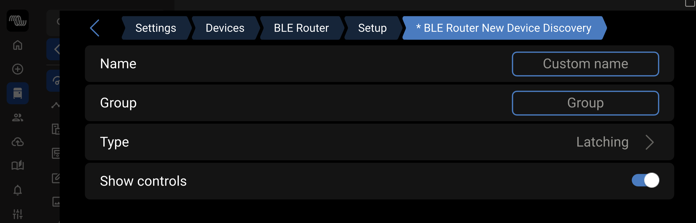

# dbus-ble-advertisements

BLE Advertisement Router for Venus OS

Monitors BLE advertisements via `btmon` and distributes them via D-Bus signals to multiple consumers.

## Overview

This service provides a centralized BLE advertisement router that:
- Monitors BLE advertisements using `btmon` (Bluetooth monitor)
- Filters based on manufacturer IDs and MAC addresses registered via D-Bus
- Only broadcasts updates when data changes (or every 10 minutes as heartbeat)
- Emits D-Bus signals for matching advertisements
- Allows multiple services to consume BLE data without scanner conflicts

**Registration**: Clients register filters by creating D-Bus objects at:
- `/ble-advertisements/{service_name}/mfgr/{id}` - for manufacturer ID filtering
- `/ble-advertisements/{service_name}/addr/{mac}` - for MAC address filtering

**Signals**: The router emits `Advertisement` signals on those same exact paths (per-application).

**Multi-client support**: Multiple services can independently register for the same manufacturer/MAC. Each gets its own signal path.

**Note**: This service only handles BLE advertisements (broadcast data).
It does not support GATT connections or two-way communication.

## Architecture

```
btmon → dbus-ble-advertisements → D-Bus Signals
                                  ├─> orion-tr
                                  ├─> seelevel
                                  └─> other services
```

## Why This Approach?

Multiple BLE scanners (using `bleak` or similar libraries) cannot coexist on Venus OS - BlueZ only allows one active scanner at a time. By using `btmon` to passively monitor HCI traffic, this router service allows unlimited consumers to receive BLE advertisements without conflicts.

## Installation

### Recommended: One-Line Remote Install

```bash
ssh root@<cerbo-ip> "curl -fsSL https://raw.githubusercontent.com/TechBlueprints/dbus-ble-advertisements/main/install.sh | bash"
```

The installer will:
- Install git if needed
- Clone or update the repository
- Install or restart the service
- Check discovery status and warn if disabled

### Alternative: Manual Installation

If you prefer to install manually:

```bash
# SSH into your Cerbo
ssh root@<cerbo-ip>

# Install git (if not already installed)
opkg install git

# Clone the repository
cd /data/apps
git clone https://github.com/TechBlueprints/dbus-ble-advertisements.git

# Run the service installer
cd dbus-ble-advertisements
bash install-service.sh
```

## D-Bus Interface

### Service Name

**`com.victronenergy.switch.bleadvertisements`**
- Service for BLE advertisement routing and UI integration
- **Use this for service availability checks**
- Appears in Venus OS device list

### Paths
- **Main**: `/ble_advertisements`
- **Registration**: `/ble_advertisements/{service_name}/mfgr/{id}` or `/ble_advertisements/{service_name}/addr/{mac}`

### Signal
```
Interface: com.victronenergy.switch.bleadvertisements
Signal: Advertisement(string mac, uint16 manufacturer_id, array of bytes data, int16 rssi, string interface, string name)
```

Emitted when a BLE advertisement matching configured filters is received.

**Parameters:**
- `mac`: MAC address (format: "AA:BB:CC:DD:EE:FF")
- `manufacturer_id`: BLE manufacturer ID (e.g., 0x02E1 for Victron)
- `data`: Raw advertisement data bytes
- `rssi`: Signal strength in dBm
- `interface`: HCI interface name (e.g., "hci0")
- `name`: Device name (empty string if unknown/not broadcast)

## Client Registration

Clients register their filter requirements by creating D-Bus objects at specific paths.

### Register for Manufacturer ID

To receive all advertisements from a specific manufacturer:

```python
import dbus
import dbus.service
from dbus.mainloop.glib import DBusGMainLoop

DBusGMainLoop(set_as_default=True)
bus = dbus.SystemBus()

# Register for Victron Energy (0x02E1 = 737 decimal)
class VictronRegistration(dbus.service.Object):
    def __init__(self, bus):
        dbus.service.Object.__init__(
            self,
            dbus.service.BusName('com.victronenergy.orion-tr', bus),
            '/ble-advertisements/orion-tr/mfgr/737'
        )

registration = VictronRegistration(bus)
```

### Register for Specific MAC Address

To receive advertisements from a specific device only:

```python
# Register for specific MAC (remove colons from MAC in path)
class DeviceRegistration(dbus.service.Object):
    def __init__(self, bus):
        dbus.service.Object.__init__(
            self,
            dbus.service.BusName('com.victronenergy.orion-tr', bus),
            '/ble-advertisements/orion-tr/addr/EFC1119DA391'
        )

registration = DeviceRegistration(bus)
```

### Complete Example

```python
import dbus
import dbus.service
from dbus.mainloop.glib import DBusGMainLoop
from gi.repository import GLib

DBusGMainLoop(set_as_default=True)
bus = dbus.SystemBus()

# Register for Victron devices
class VictronFilter(dbus.service.Object):
    def __init__(self, bus):
        bus_name = dbus.service.BusName('com.victronenergy.orion-tr', bus)
        dbus.service.Object.__init__(self, bus_name, '/ble-advertisements/orion-tr/mfgr/737')

# Create registration
filter_reg = VictronFilter(bus)

# Subscribe to advertisements on the SAME path as registration
def advertisement_callback(mac, mfg_id, data, rssi, interface, name):
    print(f"Received from {mac} ({name}): mfg={mfg_id:#06x} len={len(data)} rssi={rssi} if={interface}")
    # Process data...

bus.add_signal_receiver(
    advertisement_callback,
    signal_name='Advertisement',
    dbus_interface='com.victronenergy.switch.bleadvertisements',
    path='/ble-advertisements/orion-tr/mfgr/737'  # Same path as registration!
)

# Run main loop
mainloop = GLib.MainLoop()
mainloop.run()
```

### Registration Notes

- **Path format**: `/ble-advertisements/{your_service_name}/mfgr/{decimal_id}` or `/ble-advertisements/{your_service_name}/addr/{MAC_NO_COLONS}`
- **Signal path**: Signals are emitted on the same path as your registration (per-application, not shared)
- **Multiple registrations**: A service can create multiple registration objects for different manufacturers/MACs
- **Multi-client support**: Multiple services can register for the same manufacturer/MAC - each gets signals on their own path
- **Auto-discovery**: The router scans for registrations at startup and when services appear/disappear (event-driven)
- **No cleanup needed**: When your service exits, D-Bus automatically removes the objects and router cleans up emitters
- **Signal parameters**: `Advertisement(mac, manufacturer_id, data, rssi, interface)` - includes which HCI interface saw it
- **Deduplication**: Only data changes trigger signals (RSSI and interface changes alone don't trigger duplicates)

### Filter Logic

- If only manufacturer IDs registered: broadcasts all matching advertisements
- If both manufacturer ID and MAC registered: broadcasts only if BOTH match
- If only MACs registered: broadcasts only those specific devices

## Configuration

### Device Discovery

The BLE Advertisements service automatically discovers BLE devices and creates switchable controls for them in the Venus OS UI.

**Accessing the BLE Advertisements switches:**

1. From the main screen, tap the **square toggle icon** (top left corner)
2. This opens the Settings pane showing all available switches
3. Scroll to find **BLE Advertisements** switches

> **Don't see switches?** See the [Switches Not Visible](#switches-not-visible) troubleshooting section.


*The square toggle icon (top left, circled in red) opens the Settings pane where you can control all switches including BLE Advertisements.*


*The BLE Advertisements switches screen showing the discovery toggle and discovered devices. Each device can be individually enabled or disabled.*

**Key features:**
- **BLE Advertisements New Device Discovery** - Toggle to enable/disable automatic device discovery
- **Discovered Devices** - Each discovered device gets its own enable/disable toggle with MAC address
- **Active Indication** - The asterisk (*) indicates the discovery toggle is currently visible in the UI

### How to Re-enable Hidden Discovery

By default, the "BLE Advertisements New Device Discovery" toggle may be hidden to reduce UI clutter after initial setup. To re-enable it:

1. Tap the **square toggle icon** (top left) to open the Settings pane
2. Find the **BLE Advertisements** switches
3. Tap the **gear/settings icon** on the "BLE Advertisements New Device Discovery" switch
4. Enable **"Show controls"**



*The settings page for the discovery toggle. Enable "Show controls" to make the discovery toggle visible in the main switches screen.*

Once enabled, the discovery toggle will appear with an asterisk (*) in the main switches screen, allowing you to:
- Turn on discovery to detect new BLE devices
- Turn off discovery when you're done to save battery/resources
- Re-enable it anytime you need to add new devices

**Note:** This same process applies to other switch-based services like SeeLevel Sensor Control and Orion-TR.

## Troubleshooting

### Switches Not Visible

#### If the square toggle icon doesn't appear at all on the main screen:

This means no switches are currently enabled on your system. To enable discovery and create the initial switches, you need to access the device list:

**Step 1: Access the Device List**
1. From the main screen, tap the **round toggle icon** (top left corner, next to where the square one would be)
2. This opens the device list showing all DBus devices
3. Scroll down to find **"BLE Advertisements"** device

**Step 2: Enable Discovery**
1. Tap on the **BLE Advertisements** device
2. Find the setting **"BLE Advertisements New Device Discovery"**
3. Toggle it **ON** (this enables BLE scanning)

**Step 3: Wait for Discovery**
1. Wait 30-60 seconds for BLE devices to be discovered
2. Once discovered, device switches will appear
3. The **square toggle icon** should now appear on the main screen

**Step 4: Configure Discovery (Optional)**
- After initial setup, you can disable discovery to save resources
- Discovered devices persist across reboots
- Re-enable discovery anytime you need to add new devices

#### If the Settings pane opens but BLE Advertisements switches aren't visible:

Switches may be hidden ("Show controls" disabled). See [How to Re-enable Hidden Discovery](#how-to-re-enable-hidden-discovery) above.

## Service Management

```bash
# Start
svc -u /service/dbus-ble-advertisements

# Stop
svc -d /service/dbus-ble-advertisements

# Restart
svc -t /service/dbus-ble-advertisements

# Status
svstat /service/dbus-ble-advertisements

# View logs
tail -f /var/log/dbus-ble-advertisements/current
```

## License

Apache License 2.0 - See LICENSE file

Copyright 2025 Clint Goudie-Nice
